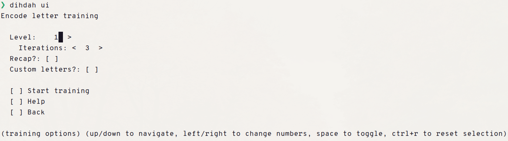
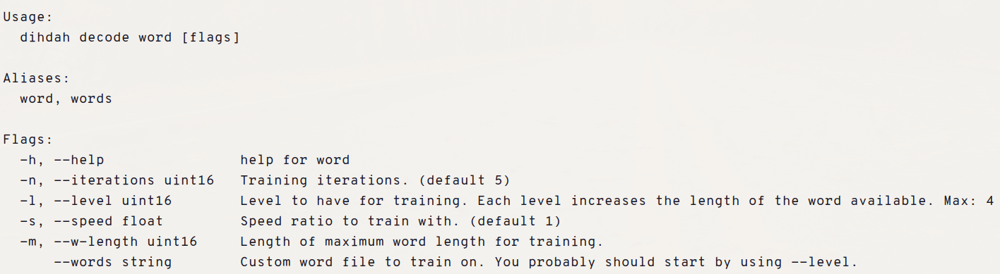
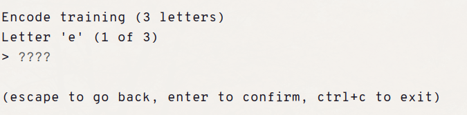
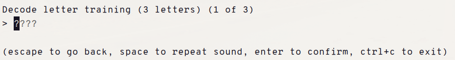
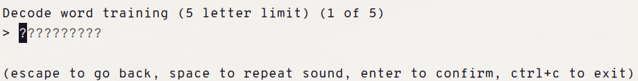
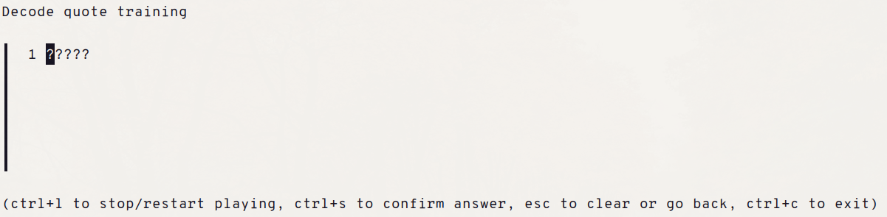

# Dihdah


_TUI Preview of dihdah_


_CLI Preview of dihdah_

This is a CLI application that creates training drills for learning morse code.

Ever wonder on how to learn morse code? This is one of the ways of doing so: by
repeatedly trying to recall, listen, and write by hand those morse codes!

## Main features:

- Is both a flag-based CLI and a TUI.
  - The TUI can be run by typing `didhah ui`. The CLI, meanwhile, can be explored by typing `dihdah`.
- Adjustable speeds, word assets, and quote assets
  - This CLI also holds its own default assets, making it a portable executable
  - The base speed of the application playing morse code is around 20wpm.

## Commands

### Encode drills



_`encode`, where you can write the letters of the morse code yourself._

### Decode drills

Drills that you listen and try to figure out what letter/word/quote is being played.



_`decode letters` are for listening to letters_



_`decode words` are for listening to words_



_`decode quotes` are for listening to quotes_

## Caveats

- This command line application focuses on providing drills to the user to be proficient on
  decoding only the latin alphabet parts -- the letters a to z.
- Encode drills are only for learning the morse code alphabet, not for learning
  the timings of how to send a morse code signal. The terminal does not give a consistent
  interface for detecting how long a keypress is held, so this is an unfortunate situation :(
- For the convenience of the user, the application uses comma `,` as the dashes and the period `.` as the dot.

## Installation

> [!CAUTION]
> This application has a (transitive) dependency to 'github.com/ebitengine/oto'
> for playing sounds. Check the repo for its build prerequisites.

If you have at least Go 1.25, install using the following command:

```
go install github.com/noAbbreviation/dihdah
```

Alternatively, you can download the binaries in the [Releases](https://github.com/noAbbreviation/dihdah/releases)
of this repository.
